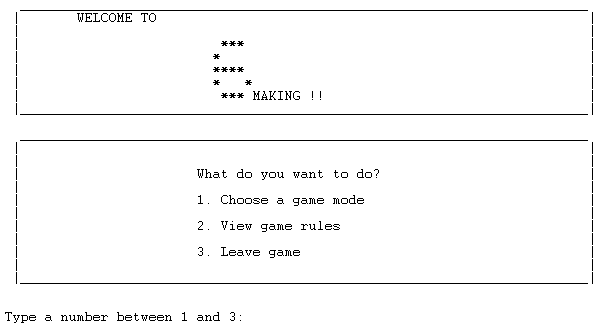
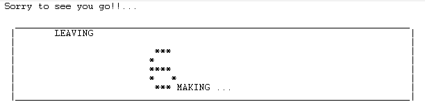

# SixMaking

Nota: 19.43/20.0

## Grupo: SixMaking_7

|Nome | Contribuição |
|---------------------------------------------|-----|
|Guilherme Brandão Monteiro (up202108668)     | 50% |
|Sofia Resende Ferreira de Sá (up202108676)   | 50% |

## Instalação e Execução

Para executar o jogo, é necessário instalar o **SICStus Prolog** (de preferência, a [versão 4.8.0](https://sicstus.sics.se/download4.html#win32)), fazer *download* dos ficheiros presentes em **PFL_TP1_T06_SixMaking_7.zip** e descompactá-los. Dentro do diretório **src**, deve consultar o ficheiro **game.pl**, através de [File] -> [Consult] -> [game.pl] ou diretamente da linha de comandos do SICStus Prolog. Por fim, para iniciar o jogo, basta executar o comando **``play.``**. O jogo está disponível em ambientes Windows e Linux.

Para a possibilidade de observar todo o jogo sem limpeza permatura da consola do SICStus, recomendamos aumentar o número de linhas da consola, por exemplo, para 1000, através de [Settings] -> [Window Settings] -> [Save lines] -> [1000]. Esta alteração é de maior importância para a observação de um jogo entre dois computadores. Desta forma, as pequenas regras impressas antes de cada jogo ficarão visíveis durante mais tempo também.

## Descrição do Jogo

O jogo Six MaKING é uma criação de Dorsonczky József, e foi publicado em 2013 pela Mind Fitness Games (OVECo S.R.L.). É uma variação interessante do xadrez, no qual torres são construídas utilizando discos de madeira. Cada disco representa uma peça de xadrez, com o valor de: 1 disco para o Peão, 2 para a Torre, 3 para o Cavalo, 4 para o Bispo, 5 para a Rainha, e 6 ou mais para o Rei.

O objetivo do jogo é construir um Rei utilizando seis ou mais discos da sua cor no topo da torre.

O jogo é jogado em um tabuleiro de 5x5 ou 4x4, dependendo da versão escolhida, e cada jogador possui 16 discos de madeira ou 12 na versão 4x4. Os jogadores escolhem a cor com a qual desejam jogar e definem a ordem inicial.

O jogo começa com o tabuleiro vazio, e os jogadores alternam as suas jogadas. Cada jogador, na sua vez, pode escolher entre:

- Colocar um novo disco (um Peão) no tabuleiro;
- Mover uma torre completa ou parte dela.

Para colocar um novo disco, o jogador pode escolher qualquer célula vazia do tabuleiro.

Para mover uma torre ou parte dela, o jogador segue os movimentos correspondentes às peças do xadrez. Por exemplo, uma torre composta por 2 discos (Torre) pode mover-se em qualquer direção ortogonal, enquanto que uma torre de 3 discos (Cavalo) move-se em forma de 'L' em cima de outra torre. As torres apenas podem ser movidas para cima de outras torres, e nunca para células vazias.

O jogo termina quando a primeira torre com seis ou mais discos (o Rei) é construída. O vencedor é o jogador que tem a sua cor no topo dessa torre.

Links de Referência:
- https://www.boardspace.net/sixmaking/english/Six-MaKING-rules-Eng-Ger-Fra-Ro-Hu.pdf


## Lógica do Jogo


### Representação Interna do Estado do Jogo

O estado interno do jogo `GameState` é representado por uma lista com 2 elementos: o tabuleiro (`board`) e o jogador atual (`player`).
- O **jogador** toma os valores 'player1' ou 'player2', e é lhe atribuído um nome dado pelo utilizador no caso de ser um jogador humano, ou 'Computer' no caso de ser um computador. Para os computadores, é também atribuído um nível de dificuldade, 1 (easy) ou 2 (hard).
- O **tabuleiro** é representado por uma lista de listas, todas elas com o tamanho indicado pelo utilizador. Numa fase inicial, todas as células do tabuleiro tem os valores `empty`, como podemos ver na representação do `initial_state/2` para um tabuleiro 4x4: 
```prolog 
initial_state(4, [
    [empty, empty, empty, empty],
    [empty, empty, empty, empty],
    [empty, empty, empty, empty],
    [empty, empty, empty, empty]
]).
```
Já as torres são representadas por uma lista de discos, sendo estes representados internamente pelos átomos `x` e `o`, correspondentes aos jogadores 1 e 2, respetivamente. Exemplos de possíveis torres são:
```prolog
[x]                -> peão
[x, o]             -> torre
[x, o, x]          -> cavalo
[x, o, x, x]       -> bispo
[x, o, x, x, o]    -> rainha
[x, o, x, x, o, x] -> rei
```
Representação interna do tabuleiro numa fase intermédia do jogo:
```prolog
 MidBoard = [
    [empty, [x,o], [x], [o]],
    [empty, empty, empty, empty],
    [[o], empty, [o,o,x], empty],
    [empty, [x], empty, empty]
]
```

Representação interna do tabuleiro na fase final do jogo:
```prolog
 FinalBoard = [
    [[o], [x,o,o,o,x,x], empty, [o]],
    [empty, empty, empty, empty],
    [[o], empty, empty, empty],
    [empty, [x], empty, empty]
]
```
---


### Visualização do Estado do Jogo


Antes de iniciar o jogo, o utilizador será deparado com um menu inicial, que disponibiliza as seguintes opções:

<br>


Poderá optar por visualizar as regras do jogo e voltar atrás para o menu inicial, ou, por outro lado, sair do jogo. 

<br>
<br>

Até este ponto, a consola do SICStus vai sendo limpa através do predicado:
```prolog
clear_console :-
    write('\33\[2J').
```

Após optar por "escolher modo de jogo", algumas configurações devem ser definidas:
- Modo de jogo (*Player vs. Player, Player vs. Computer, Computer vs. Computer*)
- Nome do jogador, no caso optar por um jogo com um jogador humano
- Nível de dificuldade, no caso de optar por um jogo com o computador (*Easy* ou *Hard*)
- Primeiro jogador a jogar 
- Tamanho do tabuleiro (4x4 ou 5x5)

Quando as configurações estiverem definidas, o jogo estará pronto para começar. A consola é limpa novamente e um pequeno conjunto de regras do jogo é impresso (apenas como meio de lembrança), assim como o primeiro tabuleiro, vazio. 
Aparecerá também uma mensagem a indicar qual o jogador que começa a jogar e o menu de opções de movimentos que ele poderá escolher fazer. Para cada uma destas jogadas, um menu diferente será impresso, dependendo daquilo que a jogada consiste:
1. Adicionar um peão - escolher linha e coluna
2. Mover uma torre - escolher linha e coluna da torre a mover e linha e coluna do destino
3. Separar uma torre - escolher linha e coluna da torre a separar, o número de discos a separar e a linha e coluna do destino

A validação de *input* do utilizador é feita pelo predicado:
```prolog
choose_number(SameN, SameN, Context, Value):-
    repeat,
    format('~a (can only be ~d): ', [Context, SameN]),
    read_number(Value),
    Value == SameN, !.
% Checks if the number is between Min and Max.
choose_number(Min, Max, Context, Value):-
    repeat,
    format('~a between ~d and ~d: ', [Context, Min, Max]),
    read_number(Value),
    between(Min, Max, Value), !.
  ```
Este verifica se o valor submetido pelo utilizador pertence ao intervalo definido ou se é exatamente o único valor que este pode submeter num dado contexto.

De forma a representar visualmente o `GameState` interno, foi criado o predicado `display_game/1`, que recebe o tabuleiro. Este chama predicados que imprimem o tabuleiro, célula a célula, de forma recursiva, com o numeração para as linha e colunas. Na representação de cada célula, utilizamos o predicado  `translate/2`, que converte o átomo/lista presente na célula para um caracter. No caso das torres, o caracter escolhido depende do comprimento da lista que a representa. As conversões são as seguintes:
```prolog
empty  -> ' '
peão   -> 'P'
torre  -> 'R'
cavalo -> 'C'
bispo  -> 'B'
rainha -> 'Q'
rei    -> 'K'
```
É importante também destacar que, dependendo do último elemento da lista que representa uma peça(topo), o caracter correspondente é maiúsculo ou minúsculo, indicando qual é o jogador que tem a sua cor no topo da torre.
Assim, as representações visuais dos tabuleiros indicados na secção anterior são as seguintes:<br>

**Tabuleiro inicial** <br>
<br>
**Tabuleiro intermédio** <br>
<br>
**Tabuleiro final** <br>
<br>


---
### Validação e Execução de Jogadas

O funcionamento do jogo baseia-se num ciclo, o ***game_cycle***, representado pelo seguinte predicado:
```prolog
% game_cycle(+OldGameState, +GameState)
% Loop that keeps the game running and checks if the game is over. If it´s not, calls the get_move predicate to get the next move.
% Checks if game is over. If it is, prints a winning message.
game_cycle(_OldGameState, GameState):-
    [Board, _Player] = GameState,
    game_over(Board, Winner), !, 
    display_game(Board),
    write('GAME OVER\n'), nl,
    show_winner(Winner).

% Calls recursively the get_move predicate to get the next move, while there is no winner, changing players' turns.
game_cycle(OldGameState, GameState):-
    [Board, Player] = GameState, 
    display_game(Board),
    print_turn(Player),
    get_move(OldGameState, GameState, NewGameState), 
    game_cycle(GameState, NewGameState).
```
É através do predicado `get_move/3` que o utilizador escolhe a jogada que quer fazer, ou para o caso de o jogador ser um computador, é chamado o predicado `move_computer/4`, analisado mais à frente. Após indicar o tipo de jogada que quer fazer, `move_option/4` chama os predicados que tratam da validação e execução dessa jogada .

A forma como se valida e executa cada jogada está dependente do seu tipo. Para jogadas do tipo "**Adicionar peão**", utilizamos o predicado `place_pawn/5` para verificar se a célula escolhida está vazia e se o jogador ainda tem peões disponíveis. Se estas condições se verificarem, este chama o predicado `place_tower/5`, que adiciona um peão do respetivo jogador à célula escolhida e retorna o novo tabuleiro (`NewBoard`). Se alguma das condições de validação falhar, será impressa uma mensagem de feedback a explicar o motivo.
```prolog
place_pawn(Board, X, Y, Player, NewBoard) :-
  empty_cell(Board, X, Y),
  length(Board, Size),
  player_char(Player, Char),
  under_piece_limit(Board, Size, Char),
  place_tower(Board, X, Y, [Char], NewBoard).
```
Para jogadas dos tipos "**Mover torre**" e "**Separar torre**", devido à complexidade do movimento das peças, foi necessário criar um predicado `valid_moves/4` que calcula todas as jogadas válidas para a peça indicada pelo utilizador e pede para este escolher uma delas, garantindo assim que a jogada estará sempre válida. 
```prolog
valid_moves(Board, Player, X, Y, ListOfMoves) :-
  get_tower(Board, X, Y, Tower),
  \+ empty_cell(Board, X, Y),
  findall([NewX, NewY], (
      valid_move(Board, Player, X, Y, NewX, NewY, Tower)
  ), ValidMoves),
  sort(ValidMoves, ListOfMoves).

valid_move(Board, Player, X, Y, NewX, NewY, Tower) :-
  inside_board(Board, NewX, NewY),
  \+ empty_cell(Board, NewX, NewY),
  length(Tower, L),
  valid_piece_movement(Board, X, Y, NewX, NewY, L),
  tower_top(Tower, Top),
  check_possible_tower(Board, Player, NewX, NewY, L, Top).
```
Esse cálculo das jogadas válidas tem em conta os movimentos possíveis para o tipo de peça escolhida (semelhantes ao xadrez, mas apenas para células já ocupadas com outras torres), com o predicado `valid_piece_movement/6` e se esse movimento não resulta numa vitória direta do oponente (`check_possible_tower/7`).
Depois do utilizador escolher uma destas jogadas, é chamado o respetivo predicado que executa essa jogada e retorna a `NewBoard`.
De modo a respeitar a "KO rule", também se verifica se a nova jogada não desfaz a jogada anterior do oponente. Para isso, é guardado o estado do jogo anterior, que depois é comparado com o estado atual.

No caso de **Mover torre**, esse predicado é o `move_tower/6`, que move a torre em (`X`, `Y`), deixando essa célula vazia, e coloca-a por cima da torre em (`NewX`, `NewY`). 
```prolog
move_tower(Board, X, Y, NewX, NewY, NewBoard) :-
  get_tower(Board, X, Y, Tower),
  place_tower(Board, X, Y, empty, Board1),
  move_pieces(Board1, NewX, NewY, Tower, NewBoard).
```
No caso de **Separar torre**, esse predicado é o `separate_tower/7`, que separa a torre em (`X`, `Y`) em duas torres, uma com os `NPieces` discos do topo, que será movida para (`NewX`, `NewY`) e outra com o resto dos discos, que ficará na célula original (`X`, `Y`).
```prolog
separate_tower(Board, X, Y, NewX, NewY, NPieces, NewBoard) :-
  get_tower(Board, X, Y, Tower),
  split_list(Tower, Part1, NPieces, Part2),
  place_tower(Board, X, Y, Part1, Board1),
  move_pieces(Board1, NewX, NewY, Part2, NewBoard).
```

---

### Lista de Jogadas Válidas
Para obter a lista de todas as jogadas válidas para um dado estado de jogo, utiliza-se o predicado `get_all_moves/3` (semelhante ao "valid_moves/3" do enunciado), que cria uma lista onde junta todas as jogadas válidas de cada tipo (Adicionar peão, Mover torre e Separar torre). Aqui, chama o predicado `valid_moves/4`, descrito na secção anterior, para cada célula do tabuleiro, e constrói uma lista que representa cada jogada na estrutura `[MoveType, Player, X, Y, NewX, NewY, NPieces]`, onde `MoveType` é o tipo de jogada (1,2,3), `Player` indica o jogador que vai jogar, `X` e `Y` são as coordenadas da célula de origem, `NewX` e `NewY` são as coordenadas da célula de destino e `NPieces` é o número de peças a separar (no caso de MoveType ser 3, senão é -1). Esta lista é utilizada quando o jogador é um computador, que posteriormente traduzirá cada jogada para um novo tabuleiro através do predicado `translate_move/3`.
```prolog
get_all_moves(Board, Player, Moves) :-
  get_moves_by_type(Board, Player, Moves1, 1),
  get_moves_by_type(Board, Player, Moves2, 2),
  get_moves_by_type(Board, Player, Moves3, 3),
  append(Moves1, Moves2, Moves12),
  append(Moves12, Moves3, Moves).
```
---

### Fim do Jogo
No predicado do ciclo do jogo, é verificado se o jogo terminou, através do predicado ``game_over/2``. Este predicado itera sobre todo o tabuleiro com o ``check_winner/2``, verificando se existe alguma torre com 6 ou mais discos, e em caso positivo, chamará  o predicado ``top_to_player/2``, para determinar o vencedor do jogo, analisando o disco presente no topo dessa torre. Caso contrário, o jogo continua no outro predicado do ``game_cycle/2``.
```prolog
game_cycle(_OldGameState, GameState):-
    [Board, _Player] = GameState,
    game_over(Board, Winner), !, 
    display_game(Board),
    write('GAME OVER\n'), nl,
    show_winner(Winner).

game_over(Board, Winner):-
  check_winner(Board, Top),
  top_to_player(Top, Winner).
```

---

### Avaliação do Estado do Jogo 
Cada tabuleiro é avaliado tendo em conta a altura das torres presentes no tabuleiro atual e o topo dessas torres. Para esta avaliação, foi utilizado o predicado `value/3`, que recebe o tabuleiro, o jogador e retorna o valor do tabuleiro em função desse jogador.

Para cada jogador, são consideradas as alturas de todas as torres cujo topo lhe pertence. Para cada uma das alturas dessas torres, é atribuído um peso diferente, somando o seu quadrado ao valor total. Por exemplo, para uma torre de altura 2, é somado 2\*2=4, enquanto que para uma torre de tamanho 5, é somado 5\*5=25. Se a altura for maior do que 6, são somados 100 pontos de bónus ao seu valor total, com o objetivo de tornar evidente que o jogador ganhou. 

Os parâmetros altura e topo foram considerados devido à natureza do jogo e da caracterização do vencedor, uma vez que este será o primeiro a formar uma torre pelo menos 6 discos, com o topo seu.

O valor final no algoritmo de Minimax terá em conta a diferença entre os valores obtidos para cada jogador, evidenciando assim a vantagem de um jogador sobre o outro.

```prolog
value(Board, player1, Value) :-
  iterate_board(Board, XValue, OValue),
  Value is XValue - OValue.
value(Board, player2, Value) :-
  iterate_board(Board, XValue, OValue),
  Value is OValue - XValue.
```
O predicado ``iterate_board/3`` itera sobre o tabuleiro, calculando o valor de cada um dos jogadores (player1 e player2 como``x`` e ``o``). Num nível mais interior do algoritmo, o predicado `process_cell` é invocado e analisa o topo de cada torre, atribuindo valores de acordo com cada altura destas.

```prolog
process_cell(Cell, _, _, XValue, OValue, NewXValue, NewOValue) :-
  length(Cell, TowerHeight),
  tower_top(Cell, Top),
  update_values(Top, TowerHeight, XValue, OValue, NewXValue, NewOValue).
```
---

### Jogadas do Computador
Definimos duas dificuldades para o computador: *easy* e *hard*. O predicado que escolhe a jogada do computador é o `move_computer/4` (semelhante ao "choose_move/4" do enunciado), que recebe o estado de jogo anterior, o estado de jogo atual e o nível de dificuldade do computador e devolve novo estado de jogo.

Para a modo fácil, o computador escolhe uma jogada aleatória da lista de todas as jogadas válidas. Traduz essa jogada para um tabuleiro novo através do predicado `translate_move/3` e verifica se essa jogada não desfaz a jogada anterior do oponente ("KO rule").
Por fim, cria o novo estado de jogo com o tabuleiro novo. 
```prolog
move_computer(OldGameState, GameState, NewGameState, 1) :-
  [OldBoard, _OldPlayer] = OldGameState,
  [Board, Player] = GameState,
  get_all_moves(Board, Player, Moves),
  repeat,
  random_member(Move, Moves),
  translate_move(Board, Move, NewBoard),
  OldBoard \= NewBoard,
  change_player(Player, NewPlayer),
  NewGameState = [NewBoard, NewPlayer].
```
```prolog
% Moves of type 1 (place pawn).
translate_move(Board, [1, Player, _X, _Y, NewX, NewY, _NPieces], NewBoard) :-
    place_pawn(Board, NewX, NewY, Player, NewBoard).
% Moves of type 2 (move tower).
translate_move(Board, [2, _Player, X, Y, NewX, NewY, _NPieces], NewBoard) :-
    move_tower(Board, X, Y, NewX, NewY, NewBoard).
% Moves of type 3 (separate tower).
translate_move(Board, [3, _Player, X, Y, NewX, NewY, NPieces], NewBoard) :-
    separate_tower(Board, X, Y, NewX, NewY, NPieces, NewBoard).
```

Para a modo difícil, utilizamos um algoritmo *greedy* que utiliza a valorização dos tabuleiros de jogo para implementar um algoritmo Minimax (`minimax/7`)com dois níveis de profundidade. 
Começa por traduzir cada jogada da lista de jogadas válidas para o respetivo tabuleiro e avalia-o através do predicado `value/3`. De seguida, testa todas as respostas possíveis por parte do oponente, avaliando-as também. Calcula a diferença (Delta) entre os valores obtidos para a jogada do jogador e cada uma das respostas, guardando o menor Delta, ou seja, o que representa a melhor resposta do oponente (min). Por fim, de todas as jogadas possíveis escolhe aquela que tem um maior delta associado (max), garantindo assim que o computador escolhe a jogada que lhe dá mais vantagem, tendo em conta que o adversário também jogará da melhor forma possível.
Se existirem mais do que uma jogada com a melhor avaliação, o computador escolherá aleatoriamente uma delas, para que o jogo não seja sempre o mesmo (especialmente no modo Computador difícil vs Computador difícil).
```prolog
move_computer(_OldGameState, GameState, NewGameState, 2) :-
  [Board, Player] = GameState,
  get_all_moves(Board, Player, Moves), !,
  minimax(Board, Player, Moves, List, 2, max),
  sort(List, SortedList),
  last(SortedList, Delta-_Nbd),
  get_lowest_elements(SortedList, Delta, LowestElements),
  random_member(_Delta2-NewBoard, LowestElements),
  change_player(Player, NewPlayer),
  NewGameState = [NewBoard, NewPlayer].

minimax(Board, Player, Moves, FinalList, 2, Type) :- 
  minimax(Board, Player, Moves, [], FinalList, 2, Type).
minimax(_Board, _Player, [], Acc, Acc, 2, _Type):- !.
minimax(Board, Player, Moves, Acc, FinalList, Depth, Type) :-
  [CurrMove|T] = Moves,
  translate_move(Board, CurrMove, Board1),
  value(Board1, Player, Value1),
  max_or_min(Type, Value1, MaxValue),
  change_player(Player, NewPlayer),
  get_all_moves(Board1, NewPlayer, Moves2),
  NewDepth is Depth - 1,
  swap_min_max(Type, NewType),
  minimax(Board1, NewPlayer, Moves2, List2, MaxValue, NewDepth, NewType),
  sort(List2, SortedList2),
  [Delta | _] = SortedList2,
  NewAcc = [Delta-Board1 | Acc],
  minimax(Board, Player, T, NewAcc, FinalList, Depth, Type).
```

Existiram alguns problemas com a implementação da verificação da "KO rule" no modo difícil do computador, pelo que ela não está presente nesta dificuldade em específico. No entanto, o algoritmo Minimax, aliado com a variação na escolha das jogadas com maior avalição, mitigam bastante as chances de acontecer uma jogada que desfaça a jogada anterior do oponente. Durante a extensa fase de testes, não foi possível encontrar um caso em que isso acontecesse.


## Conclusões
O jogo SixMaking foi implementado, com sucesso, em Prolog, apresentando 2 tamanhos de tabuleiro (4x4 e 5x5) e os 3 modos de jogo esperados: Player vs. Player, Player vs. Computer e Computer vs. Computer.

Simultaneamente, foi conseguida uma implementação do nível fácil e difícil do computador. Para este último nível, *greedy*, a implementação de um algoritmo Minimax mostrou ser bastante desafiante. Foi necessário delinear uma métrica de valorização dos tabuleiros, criar um algoritmo que tivesse em conta dois níveis de profundidade e atribuir “mínimo” ou “máximo” ao valor, distinguindo assim o jogador. Nesta fase, uma possibilidade de aperfeiçoamento estaria nos níveis de profundidade a serem tidos em conta no algoritmo. Devido ao número elevadíssimo de possíveis jogadas em cada estado do jogo, a análise de apenas dois níveis mostrou ser uma opção eficiente e boa em diversos estados do jogo. Um otimização com uma implementação de um algoritmo Alpha-Beta Pruning poderia ser uma melhoria a considerar, contudo revelou-se bastante difícil devido à complexidade do Prolog.

Todas as jogadas são também corretamente validadas e é impedido que a jogada escolhida pelo jogador atual desfaça a jogada anterior do oponente (com a exceção do caso mencionado na alínea anterior). O estado do jogo anterior é guardado e, desta forma, não ocorrerá um ciclo infinito.

Durante todo o projeto, os conceitos lecionados nas aulas práticas e teóricas foram aplicados e consolidados ao longo dos vários desafios.


## Bibliografia

As regras e funcionamento do jogo foram consultadas nos seguintes links:
- https://www.boardspace.net/sixmaking/english/Six-MaKING-rules-Eng-Ger-Fra-Ro-Hu.pdf
- https://silp.iiita.ac.in/wp-content/uploads/PROLOG.pdf
- https://www.youtube.com/watch?v=FHdltzwaAJg
- https://sicstus.sics.se/documentation.html
